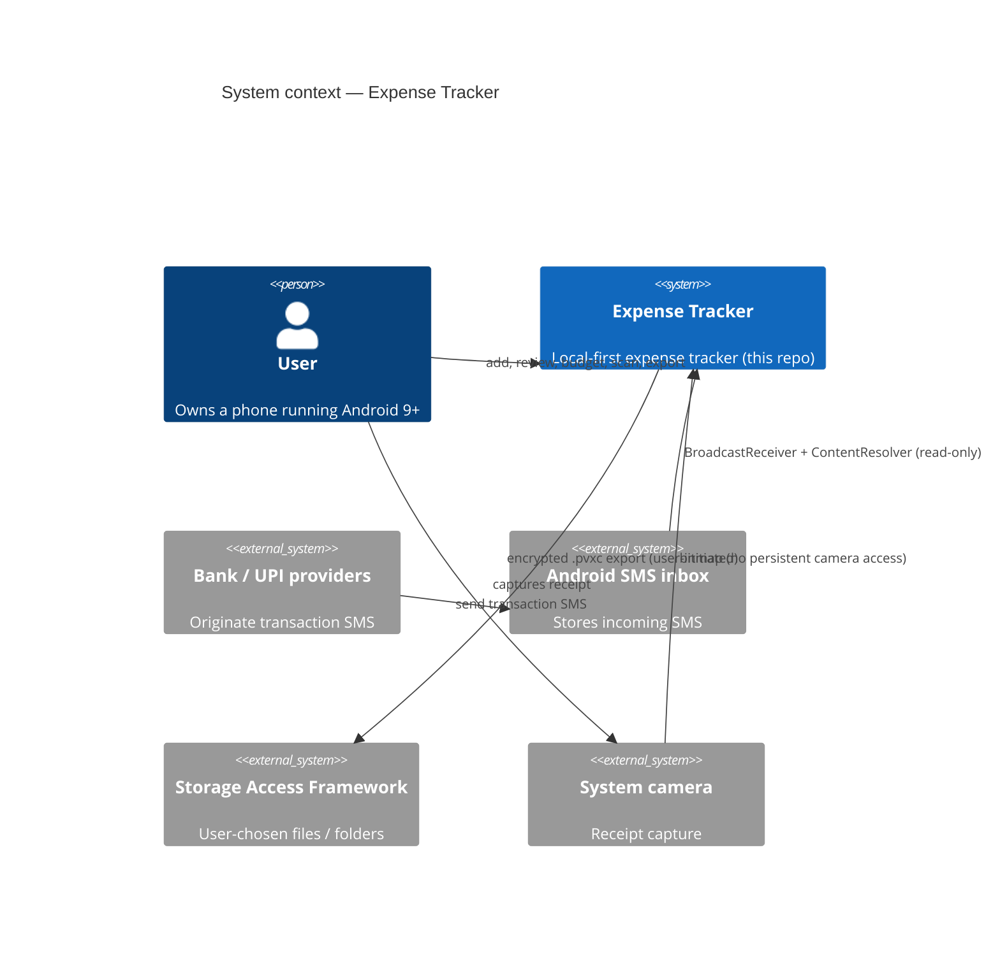
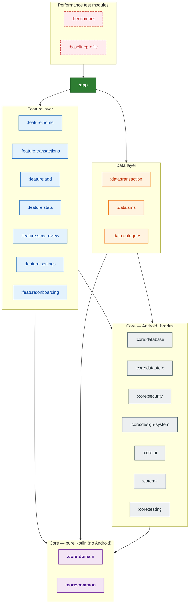
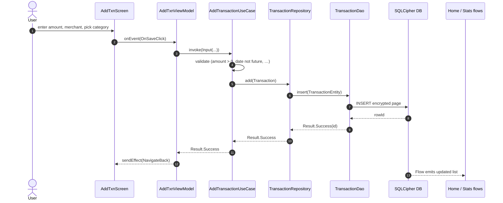
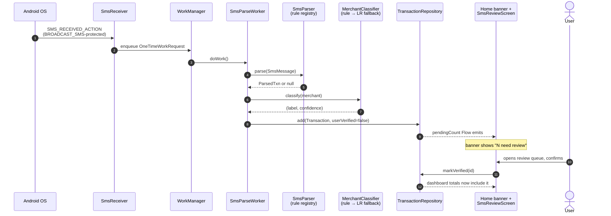
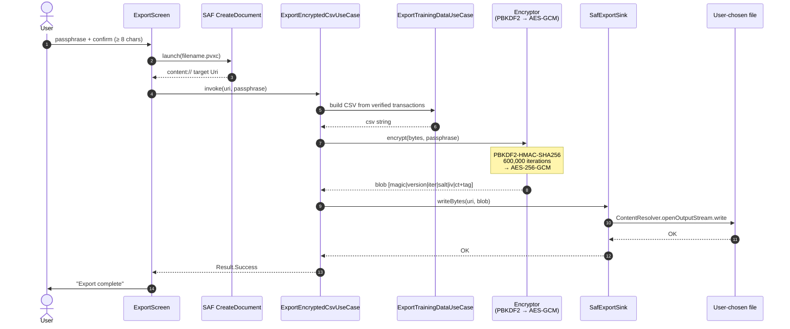
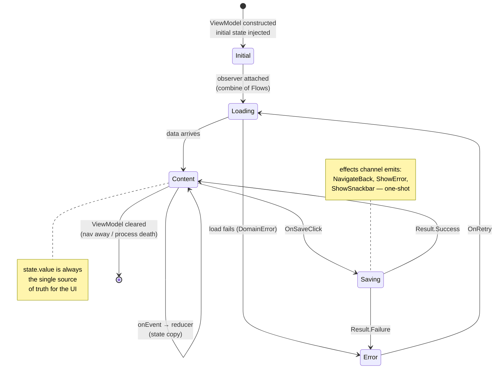
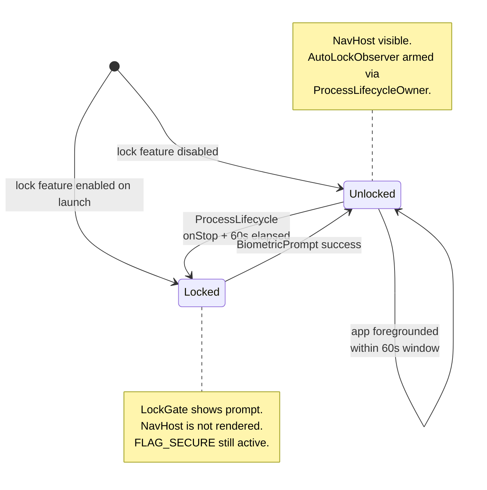

# Architecture

> Last reviewed: 2026-04-23 for v1.0.0.
>
> This document describes the system as it ships. For the phased plan that got us here
> see [BUILD.md](../BUILD.md). For individual decisions see [`docs/adr/`](adr).
>
> **Diagrams** use Mermaid (renders inline on GitHub) and D2 (richer layered graphs,
> rendered to SVG — see [`docs/diagrams/README.md`](diagrams/README.md)).

---

## Contents

1. [System context (C4)](#system-context-c4)
2. [Module graph](#module-graph)
3. [Dependency rules](#dependency-rules)
4. [Data flow](#data-flow)
5. [State management (MVI)](#state-management-mvi)
6. [Error taxonomy](#error-taxonomy)
7. [Security](#security)
8. [ML pipeline](#ml-pipeline)
9. [Tech stack](#tech-stack)
10. [FOSS policy](#foss-policy)

---

## System context (C4)

One level above the codebase. Who the app talks to, and nothing more.



The only outside systems are the Android inbox (read-only SMS access), the system
camera activity, and SAF (a user-chosen file location for encrypted exports). No
cloud, no API, no third-party backend.

---

## Module graph

22 modules grouped by layer. The headline version below is Mermaid for inline
readability; the presentation-quality version with layer-aware layout lives in
[`diagrams/module-graph.d2`](diagrams/module-graph.d2) and renders to
[`diagrams/module-graph.svg`](diagrams/module-graph.svg) (regenerate with
`d2 --layout=elk module-graph.d2 module-graph.svg` — see
[`diagrams/README.md`](diagrams/README.md)).



Every arrow is a Gradle `implementation` edge. Feature-to-feature and feature-to-data
edges are compiler-rejected (see [Dependency rules](#dependency-rules)).

## Dependency rules

Compiler-enforced via the module graph. If you need a dep that violates one of these
rules, open an ADR first.

| Module type | Allowed deps |
|---|---|
| `:app` | Anything |
| `:feature:*` | `:core:domain`, `:core:common`, `:core:ui`, `:core:design-system`, `:core:ml` (Add only), `:core:security` (Settings only) |
| `:data:*` | `:core:database`, `:core:datastore`, `:core:domain`, `:core:common`, `:core:security` |
| `:core:domain` | Pure Kotlin + `javax.inject`, `kotlinx.*`. No Android imports. |
| `:core:common` | Same as domain. |
| `:core:database` | AndroidX Room, SQLCipher, `:core:security` |
| `:core:security` | AndroidX Keystore / Biometric / Security-crypto, `:core:domain` |
| `:core:ml` | TensorFlow Lite runtime, Tesseract4Android, `:core:domain`, `:core:common` |
| `:core:ui`, `:core:design-system` | Compose + Material 3, `:core:common` |

**Forbidden across all modules** (CI-blocked):

- `com.google.android.gms.*`
- `com.google.firebase.*`
- `com.google.mlkit.*`

---

## Data flow

Four flows cover everything the app does. Each is a sequence diagram so you can trace
events time-ordered top-to-bottom.

### 1. Manual transaction entry



### 2. SMS-parsed transaction



### 3. Receipt scan

```mermaid
sequenceDiagram
    autonumber
    actor User
    participant Screen as AddTxnScreen
    participant Cam as System camera<br/>(TakePicturePreview)
    participant VM as AddTxnViewModel
    participant OCR as ReceiptOcr<br/>(Tesseract)
    participant RP as ReceiptParser
    participant Cls as MerchantClassifier

    User->>Screen: tap "Scan receipt"
    Screen->>Cam: launch()
    Cam-->>Screen: Bitmap<br/>(no CAMERA permission held)
    Screen->>VM: OnReceiptCaptured(bitmap)
    VM->>OCR: recognize(bitmap)
    OCR-->>VM: raw text
    VM->>RP: parse(text)
    RP-->>VM: ParsedReceipt(amountMinor, merchant?)
    VM->>Cls: classify(merchant)
    Cls-->>VM: suggested category
    VM-->>Screen: state: amount, merchant, suggested category
    Screen->>User: fields pre-filled; review and save
```

### 4. Encrypted export



---

## State management (MVI)

Every screen follows a three-part contract (see ADR-0005):

```kotlin
interface UiState                                 // what the screen renders
sealed interface UiEvent                          // what the user can do
sealed interface UiEffect                         // one-shot side effects (nav, snackbar)

abstract class MviViewModel<S, E, F> : ViewModel() {
    val state: StateFlow<S>
    val effects: Flow<F>
    abstract fun onEvent(event: E)
}
```

Compose reads state with `collectAsStateWithLifecycle()` and collects effects inside a
`LaunchedEffect`. Navigation and snackbar calls are always effects — never state — so
they don't replay on config change.

### The generic MVI lifecycle



### Lock state

Orthogonal to any screen's MVI — the `LockGate` composable wraps the whole `NavHost`.



---

## Error taxonomy

Domain operations return `Result<T>` with a `Failure(DomainError)`. No raw exceptions
cross a domain boundary.

```kotlin
sealed class DomainError {
    sealed class Storage : DomainError() { … }
    sealed class Sms : DomainError() { … }
    sealed class Ml : DomainError() { … }
    sealed class Validation : DomainError() { … }
    sealed class Security : DomainError() { … }
    data class Unknown(val cause: Throwable) : DomainError()
}
```

The UI layer maps each variant to a `UiText` (string-resource wrapper) and shows a
snackbar or inline message. See [`core/common/src/main/kotlin/com/paisavault/core/common/error/DomainError.kt`](../core/common/src/main/kotlin/com/paisavault/core/common/error/DomainError.kt).

---

## Security

### Threat model

| Threat | Mitigation |
|---|---|
| Lost / stolen phone | SQLCipher at rest; Keystore-bound key |
| Malicious co-installed app | Standard Android UID isolation + `allowBackup=false` |
| Casual shoulder-surfer | `BiometricPrompt` + 60-second auto-lock + `FLAG_SECURE` |
| `adb backup` extraction | Excluded via `data_extraction_rules.xml` |
| Malformed SMS (crash / DoS) | Body length cap, amount cap, ReDoS-safe regex |
| Tampered export file | AES-GCM auth tag rejects modification at decrypt |
| Wrong export passphrase | PBKDF2 fails; no oracle leak |

### Data at rest

- SQLite encrypted with SQLCipher (AES-256 page encryption).
- Passphrase: 256-bit random, generated on first launch, stored via
  `EncryptedSharedPreferences` backed by Android Keystore (hardware-backed on devices
  with StrongBox).

### App access

- `BiometricPrompt` with `BIOMETRIC_STRONG` only; weak face unlock is not accepted.
- Device-credential (PIN / pattern / password) fallback.
- `AutoLockObserver` hooks `ProcessLifecycleOwner` and locks the app 60 s after
  backgrounding.
- `FLAG_SECURE` on `MainActivity` disables screenshots and blanks the task-switcher
  preview.

### Network

No `INTERNET` permission is declared in 1.0. Without it the OS prevents all outbound
sockets regardless of application code.

### Build hardening

- R8 full mode, resource shrinking enabled
- APK Signature Scheme v3
- Release keystore kept offline (see [BUILD.md § 29.6](../BUILD.md#29-release-engineering))

### Encrypted export format (`.pvxc`)

```
| 4 bytes magic  "PV01"
| 4 bytes version  (int BE)
| 4 bytes KDF iterations  (int BE, typically 600,000)
| 16 bytes salt
| 12 bytes GCM IV
| N bytes ciphertext + 16 byte GCM auth tag
```

Details in [ADR-0008](adr/0008-encrypted-export-format.md).

---

## ML pipeline

Two layers compose into `CompositeCategorizer` (see ADR-0007):

1. **`RuleCategorizer`** — regex fast-path over ~60 pre-seeded Indian merchants. Hits
   return `confidence = 0.95` in microseconds.
2. **`ModelCategorizer`** — pure-Kotlin logistic regression on character-n-gram
   hashing-vectorizer features. Weights live in `core/ml/src/main/assets/model_v1.json`
   (not committed; generated by `ml-training/train.py`). If missing, this layer silently
   returns `Uncategorized` and the rule layer alone is used.

The hash function is `java.lang.String.hashCode` in both the Python training side
(`ml-training/hashing.py`) and the Kotlin inference side (`HashingVectorizer.kt`), so
feature indices match bit-for-bit with no vocabulary file shipped.

### OCR

`ReceiptOcr` wraps Tesseract 5 via Tesseract4Android. Requires `eng.traineddata` in
`core/ml/src/main/assets/tessdata/` (not committed). Absent file = OCR returns null,
Add screen hides the scan button.

### Why pure Kotlin instead of TFLite

Logistic regression is linear algebra — TFLite's interpreter buys us nothing over a
matrix multiply. We keep the TFLite runtime as a declared dependency only for a future
upgrade to sentence embeddings or a small transformer. See [ADR-0007](adr/0007-pure-kotlin-logreg-categorizer.md).

---

## Tech stack

All runtime dependencies are OSI-approved. Enforcement is a CI job that inspects the
release classpath.

### Shipped in 1.0

| Area | Choice | License |
|---|---|---|
| Language | Kotlin 2.0 | Apache 2.0 |
| UI | Jetpack Compose + Material 3 | Apache 2.0 |
| Navigation | Compose Navigation (type-safe, kotlinx.serialization) | Apache 2.0 |
| Database | Room + SQLCipher Community | Apache 2.0 / BSD-style |
| DI | Hilt (Dagger) | Apache 2.0 |
| Async | kotlinx.coroutines + Flow | Apache 2.0 |
| Date / time | kotlinx-datetime | Apache 2.0 |
| Serialization | kotlinx.serialization | Apache 2.0 |
| ML runtime | Pure Kotlin (TFLite declared, not used in 1.0) | Apache 2.0 |
| OCR | Tesseract4Android | Apache 2.0 |
| Crypto for exports | JDK `javax.crypto` PBKDF2 + AES-GCM | JDK (GPL + CE) |
| Background | WorkManager | Apache 2.0 |
| Biometrics | AndroidX Biometric | Apache 2.0 |
| Secure prefs | AndroidX Security-crypto | Apache 2.0 |
| Charts | Native Compose canvas (Vico planned for 1.1) | — |
| Logging | Timber | Apache 2.0 |
| Testing | JUnit 4, Kotest assertions, Turbine | EPL / Apache 2.0 |
| JDK | Eclipse Temurin / Microsoft OpenJDK 17 | GPL + CE |

### Dev-time only (not in APK)

Android Studio, Gradle, Android Gradle Plugin, detekt, ktlint, Spotless, MobSF.

### Explicitly excluded

- Google Play Services, Firebase, ML Kit
- Crashlytics, any analytics SDK
- Gemma, LLaMA, any non-OSI-licensed weights
- Argon2 native libraries (deferred — see [ADR-0008](adr/0008-encrypted-export-format.md))

---

## FOSS policy

1. Every runtime dependency must be OSI-approved or an equivalent free license (BSD
   style, MIT, Apache 2.0, GPL/LGPL compatible).
2. The CI job `foss-check` inspects the release classpath for blocked groups and fails
   the build on a violation.
3. Model weights and OCR trained data bundled in the APK must carry a FOSS license and
   be listed in the in-app NOTICE.
4. Android Studio itself is fine (core is Apache 2.0). Strict-FOSS alternative: IntelliJ
   IDEA Community + Android plugin.

Full compliance notes in [BUILD.md § 33](../BUILD.md#33-licensing--foss-compliance).
